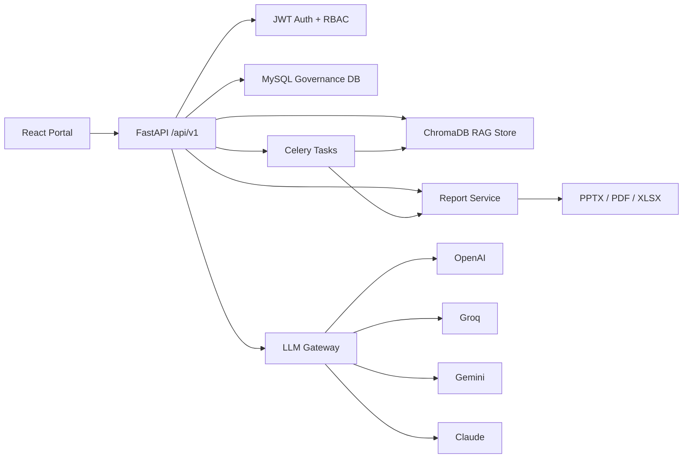

# Robust Backend Model

## Domain Model

- `Employee`: authenticated user with hierarchy role and manager relationship.
- `Account`: client account containing one or many projects.
- `Project`: delivery unit under an account, owned by program/project managers.
- `ResourceAllocation`: manual employee-to-project allocation with role, reporting manager, dates, and percentage.
- `WeeklyStatus`: daily/weekly delivery status payload indexed into Chroma.
- `AIInsight`: persisted AI delivery analysis.
- `GeneratedReport`: report job/file metadata.
- `AuditLog`: immutable governance trail for sensitive actions.

## Authority Model

The hierarchy is represented as ranked roles:

`intern < developer < team_lead < project_manager < program_manager < delivery_head`

This lets the backend enforce professional governance rules without hard-coding page behavior into the frontend.

## AI Model

The LLM gateway exposes providers even when no key is present, but only configured providers are executable.
That supports a dropdown UI cleanly:

1. Call `GET /api/v1/ai/providers`.
2. Show provider/model choices.
3. Disable or mark providers where `configured=false`.
4. Send the selected provider/model to `/api/v1/ai/rag/query`.

If the user has no matching `.env` key, AI features fail closed with an explicit API error.
